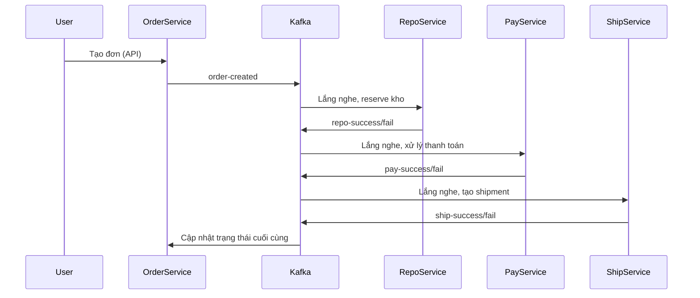

# Tổng hợp flow code nghiệp vụ Order → Repo → Pay → Ship (kafka-sync-platform)

> Dưới đây là tài liệu rút gọn, diễn giải các đoạn code quan trọng của 4 service chính (order, repo, pay, ship) trong repo. Mục tiêu giúp bạn nắm nhanh nghiệp vụ qua code thực tế, vừa đủ chi tiết vừa dễ hiểu.

---

## 1. Sơ đồ tổng quan flow nghiệp vụ



---

## 2. Chi tiết code từng Service

### 2.1 Order-service
- Nhận API tạo đơn → Lưu DB → Bắn event lên Kafka (order-created).
- Entity, service, controller đều áp dụng best practice Spring Boot, Idempotency, log đầy đủ.


### 2.2 Repo-service
- Lắng nghe event order-created từ Kafka.
- Kiểm tra tồn kho, đặt chỗ (reserve), 
- Bắn event repo-success/repo-fail lên Kafka cho các service khác review.


### 2.3 Pay-service
- Lắng nghe event repo-success từ Kafka.
- Kiểm tra số dư, reserve tiền.
- Bắn event pay-success/pay-fail lên Kafka.


### 2.4 Ship-service
#### a) Kafka Consumer
```java
@Component
@RequiredArgsConstructor
@Slf4j
public class ShippingConsumer {
    private final ShippingService shippingService;

    @KafkaListener(topics = "pay-success", groupId = "ship-group")
    public void onPaySuccess(PayStatusEvent event) {
        shippingService.updateAndCheck(event.getOrderId(), sn -> {
            sn.setPayStatus(event.getStatus());
        });
    }

    @KafkaListener(topics = "repo-success", groupId = "ship-group")
    public void onRepoSuccess(RepoStatusEvent event) {
        shippingService.updateAndCheck(event.getOrderId(), sn -> {
            sn.setRepoStatus(event.getStatus());
        });
    }

    @KafkaListener(topics = "pay-fail", groupId = "ship-group")
    public void onPayFail(PayStatusEvent event) {
        shippingService.updateAndCheck(event.getOrderId(), sn -> {
            sn.setPayStatus(event.getStatus());
        });
    }

    @KafkaListener(topics = "repo-fail", groupId = "ship-group")
    public void onRepoFail(RepoStatusEvent event) {
        shippingService.updateAndCheck(event.getOrderId(), sn -> {
            sn.setRepoStatus(event.getStatus());
        });
    }
}
```

#### b) Service (QUYẾT ĐỊNH tạo shipment, publish event, KHÔNG còn hàm handleCompensations)
```java
@Transactional
public void checkAndFinalize(String orderId) {
    ShippingSnapshot sn = repository.findById(orderId).orElseThrow(...);
    if (!sn.isFinished()) return;
    
    if(sn.isAllSuccess()) {
        sendStatus("ship-success", orderId, "SUCCESS", "Đơn hàng đã sẵn sàng giao.");
    } else {
        String failMsg = "Đơn hàng thất bại do: ";
        if ("FAILED".equals(sn.getPayStatus())) failMsg += "Lỗi thanh toán. ";
        if ("FAILED".equals(sn.getRepoStatus())) failMsg += "Lỗi kho bãi.";
        sendStatus("ship-fail", orderId, "FAILED", failMsg);
    }
}

public void updateAndCheck(String orderId, Consumer<ShippingSnapshot> updater) {
    ShippingSnapshot sn = repository.findById(orderId)
        .orElseGet(() -> ShippingSnapshot.builder().orderId(orderId).build());
    updater.accept(sn);
    repository.save(sn);
    checkAndFinalize(orderId);
}
```
**Giải thích:**
- Consumer lắng nghe event trạng thái lần lượt từ Pay/Repo, update snapshot trạng thái shipment.
- Đủ event cần thiết, service quyết định "thành công" hay "thất bại" shipment, publish result lên Kafka.
- KHÔNG còn code rollback/compensate chủ động!

---

## 3. Các nhận xét tổng kết nhanh
- Flow rõ ràng, mỗi Service chịu trách nhiệm đúng vai trò nghiệp vụ.
- Sử dụng snapshot entity để tổng hợp trạng thái từ nhiều event Pay/Repo.
- Ship chỉ quyết định pass/fail shipment chứ không rollback các bên khác.
- Logging đủ chi tiết giúp debugg dễ dàng.

---

**Tài liệu này tóm tắt các đoạn code/logic then chốt nhất và đã loại bỏ code compensate/rollback ở Ship. Dùng cho onboard, trình bày, hoặc tham khảo design.**
